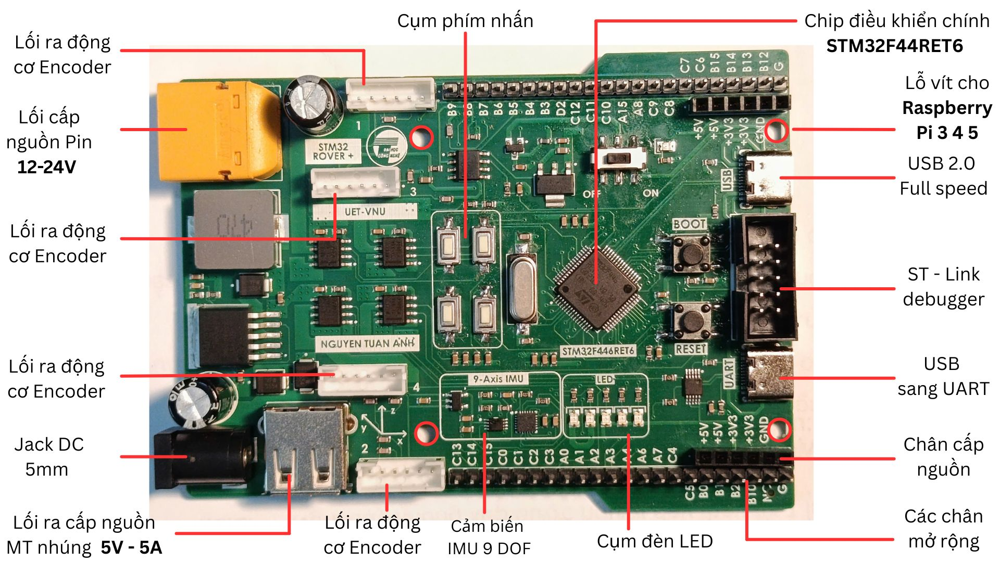
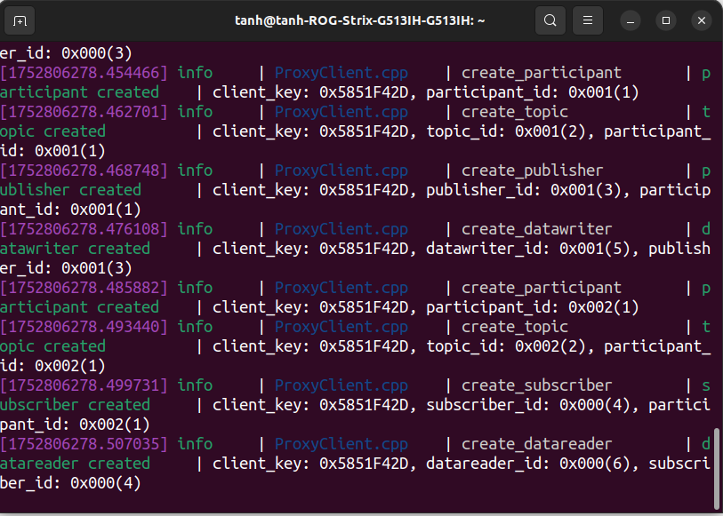

# STM32F446RET6 Micro-ROS Firmware Repository

## Description
This repository contains the firmware for the STM32F446RET6 multifunctional development board, developed by Nguyen Tuan Anh and contributed by Nguyen Quoc Trung as part of an undergraduate thesis. The firmware is built using the FreeRTOS API and integrates micro-ROS utilities from [micro_ros_stm32cubemx_utils](https://github.com/micro-ROS/micro_ros_stm32cubemx_utils). All the software used was built around the ROS2 Humble Distro.


## Installation
To clone the repository, run:
```bash
 git clone https://github.com/trungnguyen0503/micro_ros_firmware.git
 ```

## Setup Instructions
1. **Prerequisites**:
   - Install [ROS 2 Humble Hawksbill](https://docs.ros.org/en/humble/Installation.html) on Ubuntu 22.04 LTS.
   - Install [STM32CubeIDE](https://www.st.com/en/development-tools/stm32cubeide.html) or a compatible IDE.
   - Install the micro-ROS agent into the ROS2 workspace [micro-ROS setup](https://github.com/micro-ROS/micro_ros_setup).

3. **Build the Firmware**:
   - Navigate to the cloned repository: `cd micro_ros_firmware`
   - Open the project in STM32CubeIDE or use the provided build scripts (e.g., `make`).
   - Configure the micro-ROS agent and build the firmware following the instructions (FOLLOW the "Using this package with STM32CubeIDE" part) inside the [micro_ros_stm32cubemx_utils](https://github.com/micro-ROS/micro_ros_stm32cubemx_utils).

4. **Flash the Firmware**:
   - Connect the STM32F446RET6 board via a debugger (e.g., ST-Link).
   - Flash the compiled firmware (if needed) using STM32CubeIDE or a tool like [STM32CubeProgrammer](https://www.st.com/en/development-tools/stm32cubeprog.html).

5. **Connect to the PC or SBC**
   - Remove the debugger after finishing flashing the code
   - Using an USB type-C cable to connect the the UART port on the board with the usb port on the machine. Make sure to switch OFF if you use the external power source (e.g battery, DC adapter). 

## Some test commands:
1) Init micro ros agent, with the deffault 1500000 baud rate in the code 
```bash
ros2 run micro_ros_agent micro_ros_agent serial -b 1500000 --dev /dev/ttyUSB0
```
2) Check the existing nodes inside the dev board.
```bash
ros2 node list
```
3) Check the existing topics inside the dev board.
```bash
ros2 topic list
``` 
## Example Output
Below is a screenshot of the firmware running on the STM32F446RET6 board, if the log doesnt look like this, press RESET button to re-establish the session.


